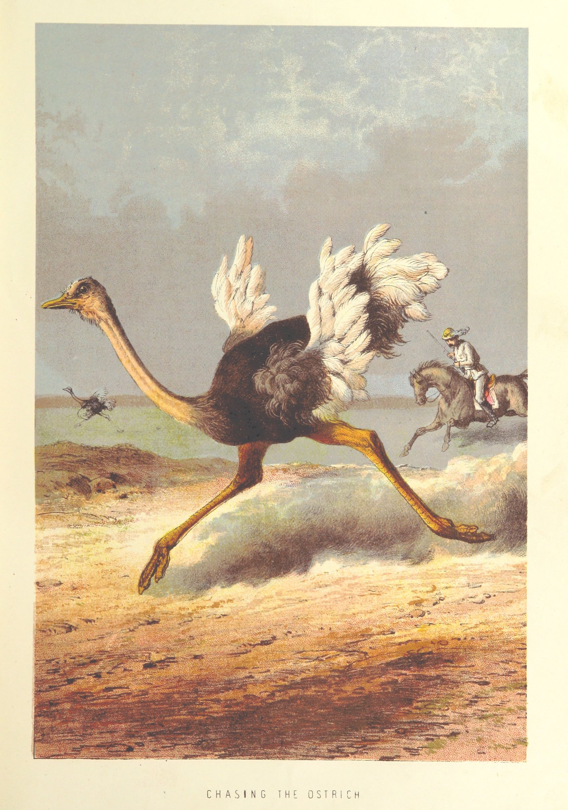

--- 
title: "JavaScript 4 Shiny - Field Notes"
author: "Colin Fay"
date: "Last build: `r Sys.Date()`"
site: bookdown::bookdown_site
documentclass: book
bibliography: [book.bib, packages.bib]
biblio-style: apalike
link-citations: yes
description: "Oui."
---

# Field Notes on JavaScript for Shiny Users {-}

```{r include = FALSE}
knitr::opts_chunk$set(echo = TRUE, comment = "#")
```


<style>
img.left {
  float: left;
  margin-right: 1em;
}
</style>

<div class = "left">



</div>

## About this bookdown  {-}

This Bookdown is the content of an informal JavaScript training given inside ThinkR, and will probably be updated from time to time. 
It's in no way supposed to be a complete JavaScript course nor even a complete book. 
Most of the content is composed of pieces of code + comments, without complete sentences. 

Please read it with this in mind.

Also, this Bookdown is `{shiny}`-centric so it focuses on things that can be useful when building Shiny application.  

What this book covers : bascic JavaScript objects, adding JavaScript to Shiny apps, the DOM elements & DOM events, jQuery, `this` and attributes, and building custom inputs for Shiny. 

You'll find in the "Examples" section pieces of code written in real life Shiny Apps. 

The Read More part points to external resources about JavaScript and Shiny. 

## Installing `{bubble}` {-}

+ R package to interact with NodeJS  

__Note: you'll need to have NodeJS installed on your machine__

```{r}
if (!requireNamespace("bubble")){
  remotes::install_github("ColinFay/bubble")
}
```

+ Set the `{knitr}` engine for Rmds

```{r}
bubble::set_node_engine()
```

+ Access a NodeJS REPL 

```{r eval = FALSE}
node_repl()
```


## About the image {-}

The illustration on this page comes from Flickr Commons, and is available [online](https://flic.kr/p/i51Hes) 

Ref : 
> Image taken from page 33 of 'Stanley and Africa: also, the travels, adventures, and discoveries of Captain John H. Speke, Captain Richard F. Burton ... and other distinguished explorers. [With plates, including portraits.]'

```{r include=FALSE}
# automatically create a bib database for R packages
knitr::write_bib(c(
  .packages(), 'bookdown', 'knitr', 'rmarkdown'
), 'packages.bib')
```


